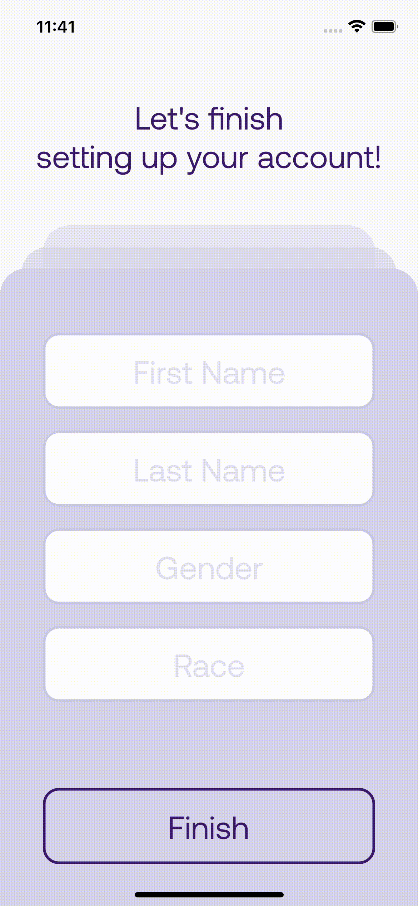
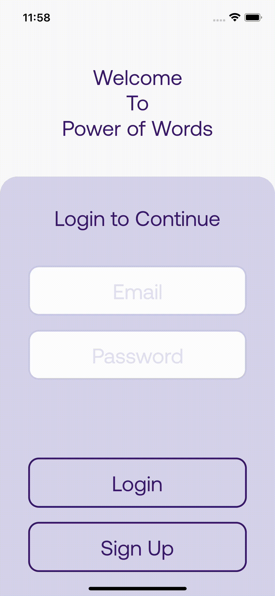

<h2>Power of Words</h2>
<h2>License</h2>

<h2>Description</h2>

Power of Words is a cross-platform mobile application designed to help users monitor, track, and find resources to help with their mental health. Fashioned in a manner similar to Twitter, users are able to post periodic, 100-word snippets about how they are feeling. Power of Words then scans these entries to look for common keywords and phrases related to mental health conditions and will recommend resources to the user based on a database of information. The app will also keep these entries in reverse-chronological order along with a rating so that users can monitor their progress through time.

<h2>Demo Animation :</h2>

<strong>Going Foward</strong>

<strong>Going Backward</strong>

<strong>Input Text</strong>

