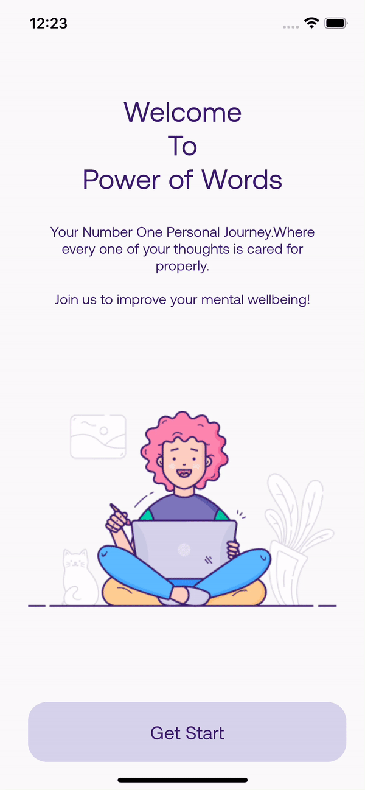

Power of Words is a multiplatform application designed to scan users' journal entries for common phrases or words that are related to commmon mental health issues. This is a class project for CIS 350-01.
<h2> To do stuff </h2>
<ul>
<li>overall GUI</li>
<li>Button for input</li>
<li>Will see next step</li></ul>

<h2>Progress : </h2>

Started page and button working :  
   
  Demo Animation : 
   

Need to do Login Resigster page 
